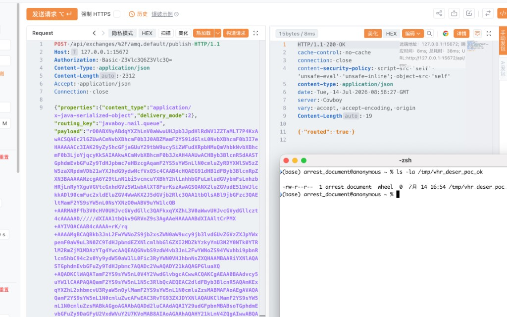

# vhr（微人事） — Spring AMQP Java Deserialization RCE (VHR-VULN-006)

| Field | Value |
|-------|-------|
| **Vendor** | lenve |
| **Product** | vhr（微人事） |
| **Version** | 1.0-SNAPSHOT |
| **Type** | Deserialization of Untrusted Data |
| **CWE** | CWE-502 |
| **Authentication** | Network access to RabbitMQ Management / AMQP (`guest`/`guest`, ports `15672` / `5673`) |

## Summary

`mailserver` consumes queue `javaboy.mail.queue` using Spring AMQP default Java serialization (`SimpleMessageConverter`). An attacker who can reach RabbitMQ Management HTTP API (or AMQP) can publish a crafted `application/x-java-serialized-object` message and achieve remote code execution on the **mailserver JVM host**.

## Root cause

- `RabbitConfig` does not configure a safe (e.g. JSON) message converter.
- `MailReceiver` (`@RabbitListener`) deserializes untrusted queue bytes via `SerializationUtils.deserialize`.

## Proof of Concept (Yakit)

Full copy-paste packets: [`../poc/VHR-VULN-006/YAKIT-PoC.md`](../poc/VHR-VULN-006/YAKIT-PoC.md)

### 1) RabbitMQ Management with default credentials

```http
GET /api/overview HTTP/1.1
Host: 127.0.0.1:15672
Authorization: Basic Z3Vlc3Q6Z3Vlc3Q=
Accept: application/json
Connection: close


```

**Result:** HTTP 200 (management_version 3.13.7)


### 2) Queue `javaboy.mail.queue` visible / enumerable

```http
GET /api/queues/%2F/javaboy.mail.queue HTTP/1.1
Host: 127.0.0.1:15672
Authorization: Basic Z3Vlc3Q6Z3Vlc3Q=
Accept: application/json
Connection: close


```

**Result:** HTTP 200, queue metadata returned (durable mail queue)


### 3) Publish Java deserialization payload → RCE on mailserver host

Publish via Management API to `javaboy.mail.queue` with `content_type=application/x-java-serialized-object` (CC/TemplatesImpl gadget → `touch /tmp/vhr_deser_poc_ok`). Full request body is in the Yakit PoC document.

**Result:** `{"routed":true}` and host file created:

```text
ls -la /tmp/vhr_deser_poc_ok
-rw-r--r--  1 ...  wheel  0  ... /tmp/vhr_deser_poc_ok
```




> RCE executes on the **mailserver application host**, not inside the RabbitMQ broker container.

## Impact

Remote code execution on the mailserver service host when RabbitMQ is network-reachable with weak/default credentials and Java serialization consumers are present.

## Remediation

1. Configure `Jackson2JsonMessageConverter` (or equivalent); ban Java native serialization.
2. Disable remote `guest` login; strong credentials + network isolation for AMQP/Management.
3. Keep gadget libraries out of classpath where possible; apply least privilege to consumers.

## References

- Yakit PoC: [`../poc/VHR-VULN-006/YAKIT-PoC.md`](../poc/VHR-VULN-006/YAKIT-PoC.md)
- Upstream project: https://github.com/lenve/vhr
